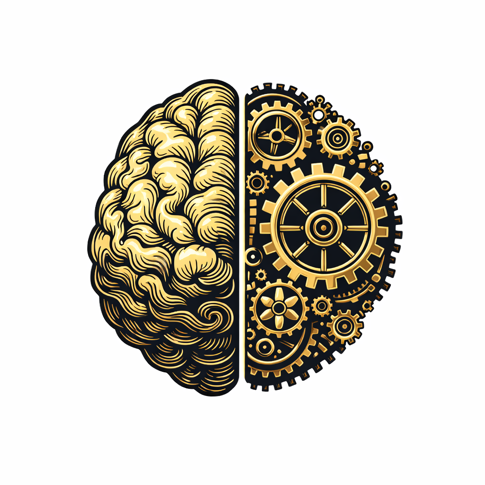

<p align="center">
  
</p>

<div align="center">

# Cogitator

### The Sovereign AI Agent Runtime

[](https://opensource.org/licenses/MIT)
[](https://www.typescriptlang.org/)
[](https://nodejs.org/)
[]()

**Kubernetes for AI Agents. Self-hosted. Production-grade. TypeScript-native.**

[Quick Start](#-quick-start) • [Architecture](#-architecture) • [Documentation](./docs) • [Roadmap](#-roadmap) • [Contributing](#-contributing)

</div>

---

## The Problem

AI agent engineering is broken:

| Pain Point         | Reality                                                      |
| ------------------ | ------------------------------------------------------------ |
| **LangChain**      | 150+ dependencies, breaking changes weekly, abstraction hell |
| **Python Scripts** | Work for demos, die in production                            |
| **Observability**  | Zero visibility into why agent loops fail or costs explode   |
| **Vendor Lock-in** | OpenAI Assistants API is powerful but proprietary            |
| **Local LLMs**     | Easy to run (Ollama), impossible to orchestrate at scale     |

We're building mission-critical systems, not chatbots. We need **infrastructure**.

---

## The Solution

Cogitator is a **self-hosted, production-grade runtime** for orchestrating LLM swarms and autonomous agents.

```
┌─────────────────────────────────────────────────────────────────────────┐
│                                                                         │
│   Your App  ──►  Cogitator  ──►  Llama 3 / Mistral / GPT-4 / Claude    │
│                     │                                                   │
│                     ▼                                                   │
│              ┌─────────────┐                                            │
│              │   Agents    │  ◄── Tools, Memory, Workflows              │
│              │   Workers   │  ◄── Sandboxed Execution                   │
│              │   Swarms    │  ◄── Multi-Agent Coordination              │
│              └─────────────┘                                            │
│                                                                         │
└─────────────────────────────────────────────────────────────────────────┘
```

### Why Cogitator?

- **OpenAI-Compatible API** — Drop-in replacement for Assistants API, works with existing SDKs
- **Run Any LLM** — Ollama, vLLM, llama.cpp, OpenAI, Anthropic, Google — all unified
- **Production Memory** — Hybrid storage: Redis (fast) + pgvector (semantic) + SQLite (portable)
- **Tool Ecosystem** — MCP-compatible, build once, use everywhere
- **Workflow Engine** — DAG-based orchestration with retry, compensation, human-in-the-loop
- **Sandboxed Execution** — Code runs in Docker/WASM, not on your host
- **Full Observability** — OpenTelemetry traces, cost tracking, token analytics

---

## Quick Start

### Prerequisites

- Node.js 20+
- Docker (for sandboxed execution)
- Ollama (for local LLMs) or OpenAI API key

### Installation

```bash
# Install CLI
npm install -g @cogitator-ai/cli

# Initialize project
cogitator init my-agents
cd my-agents

# Start runtime (pulls Ollama automatically)
cogitator up
```

### Your First Agent

```typescript
import { Cogitator, Agent, tool } from '@cogitator-ai/core';

// Define a tool with full type safety
const searchWeb = tool({
  name: 'search_web',
  description: 'Search the web for information',
  parameters: z.object({
    query: z.string().describe('Search query'),
    limit: z.number().default(5),
  }),
  execute: async ({ query, limit }) => {
    // Your implementation
    return await fetch(`https://api.search.io?q=${query}&limit=${limit}`);
  },
});

// Create an agent
const researcher = new Agent({
  name: 'researcher',
  model: 'llama3.2:latest', // or 'gpt-4o', 'claude-3-5-sonnet'
  instructions: `You are a research assistant. Use tools to find accurate information.
                 Always cite your sources.`,
  tools: [searchWeb],
});

// Run
const cog = new Cogitator();
const result = await cog.run(researcher, {
  input: 'What are the latest developments in WebGPU?',
});

console.log(result.output);
console.log(result.usage); // { tokens: 1234, cost: 0.002, latency: 1.2s }
```

---

## Packages

Cogitator is a modular monorepo. Install only what you need:

| Package                                                                                  | Description                              | Version                                                                                                                           |
| ---------------------------------------------------------------------------------------- | ---------------------------------------- | --------------------------------------------------------------------------------------------------------------------------------- |
| [@cogitator-ai/core](https://www.npmjs.com/package/@cogitator-ai/core)                   | Core runtime (Agent, Tool, Cogitator)    | [](https://www.npmjs.com/package/@cogitator-ai/core)                   |
| [@cogitator-ai/cli](https://www.npmjs.com/package/@cogitator-ai/cli)                     | CLI tool (`cogitator init/up/run`)       | [](https://www.npmjs.com/package/@cogitator-ai/cli)                     |
| [@cogitator-ai/types](https://www.npmjs.com/package/@cogitator-ai/types)                 | Shared TypeScript interfaces             | [](https://www.npmjs.com/package/@cogitator-ai/types)                 |
| [@cogitator-ai/config](https://www.npmjs.com/package/@cogitator-ai/config)               | Configuration management                 | [](https://www.npmjs.com/package/@cogitator-ai/config)               |
| [@cogitator-ai/memory](https://www.npmjs.com/package/@cogitator-ai/memory)               | Memory adapters (Postgres, Redis)        | [](https://www.npmjs.com/package/@cogitator-ai/memory)               |
| [@cogitator-ai/models](https://www.npmjs.com/package/@cogitator-ai/models)               | LLM backends (Ollama, OpenAI, Anthropic) | [](https://www.npmjs.com/package/@cogitator-ai/models)               |
| [@cogitator-ai/workflows](https://www.npmjs.com/package/@cogitator-ai/workflows)         | DAG-based workflow engine                | [](https://www.npmjs.com/package/@cogitator-ai/workflows)         |
| [@cogitator-ai/swarms](https://www.npmjs.com/package/@cogitator-ai/swarms)               | Multi-agent swarm coordination           | [](https://www.npmjs.com/package/@cogitator-ai/swarms)               |
| [@cogitator-ai/mcp](https://www.npmjs.com/package/@cogitator-ai/mcp)                     | MCP (Model Context Protocol) support     | [](https://www.npmjs.com/package/@cogitator-ai/mcp)                     |
| [@cogitator-ai/sandbox](https://www.npmjs.com/package/@cogitator-ai/sandbox)             | Docker/WASM sandboxed execution          | [](https://www.npmjs.com/package/@cogitator-ai/sandbox)             |
| [@cogitator-ai/redis](https://www.npmjs.com/package/@cogitator-ai/redis)                 | Redis client (standalone + cluster)      | [](https://www.npmjs.com/package/@cogitator-ai/redis)                 |
| [@cogitator-ai/worker](https://www.npmjs.com/package/@cogitator-ai/worker)               | Distributed job queue (BullMQ)           | [](https://www.npmjs.com/package/@cogitator-ai/worker)               |
| [@cogitator-ai/openai-compat](https://www.npmjs.com/package/@cogitator-ai/openai-compat) | OpenAI Assistants API compatibility      | [](https://www.npmjs.com/package/@cogitator-ai/openai-compat) |
| [@cogitator-ai/wasm-tools](https://www.npmjs.com/package/@cogitator-ai/wasm-tools)       | WASM-based sandboxed tools               | [](https://www.npmjs.com/package/@cogitator-ai/wasm-tools)       |

---

### Multi-Agent Swarm

```typescript
import { Cogitator, Agent, Swarm } from '@cogitator-ai/core';

const planner = new Agent({
  name: 'planner',
  model: 'gpt-4o',
  instructions: 'Break down complex tasks into subtasks.',
});

const coder = new Agent({
  name: 'coder',
  model: 'claude-3-5-sonnet',
  instructions: 'Write clean, tested code.',
  tools: [fileWrite, runTests],
});

const reviewer = new Agent({
  name: 'reviewer',
  model: 'llama3.2:70b',
  instructions: 'Review code for bugs and security issues.',
});

// Hierarchical swarm: planner delegates to coder, reviewer validates
const devTeam = new Swarm({
  supervisor: planner,
  workers: [coder, reviewer],
  strategy: 'hierarchical', // or 'round-robin', 'consensus', 'auction'
});

const result = await cog.run(devTeam, {
  input: 'Build a REST API for user authentication with JWT',
});
```

---

## Architecture

```
┌─────────────────────────────────────────────────────────────────────────────┐
│                           Cogitator Control Plane                            │
├─────────────────────────────────────────────────────────────────────────────┤
│                                                                             │
│  ┌─────────────────┐  ┌─────────────────┐  ┌─────────────────────────────┐  │
│  │    Gateway      │  │   Orchestrator  │  │      Memory Manager         │  │
│  │                 │  │                 │  │                             │  │
│  │  • REST API     │  │  • Task Queue   │  │  • Short-term (Redis)       │  │
│  │  • WebSocket    │  │  • Scheduler    │  │  • Long-term (Postgres)     │  │
│  │  • gRPC         │  │  • Load Balance │  │  • Semantic (pgvector)      │  │
│  │  • OpenAI-compat│  │  • Circuit Break│  │  • Episodic (conversations) │  │
│  └────────┬────────┘  └────────┬────────┘  └──────────────┬──────────────┘  │
│           │                    │                          │                 │
│           └────────────────────┼──────────────────────────┘                 │
│                                │                                            │
│  ┌─────────────────────────────┴─────────────────────────────────────────┐  │
│  │                        Agent Execution Engine                         │  │
│  │                                                                       │  │
│  │  ┌─────────────┐  ┌─────────────┐  ┌─────────────┐  ┌─────────────┐   │  │
│  │  │   Agent     │  │   Agent     │  │   Workflow  │  │   Tool      │   │  │
│  │  │   Worker    │  │   Worker    │  │   Engine    │  │   Registry  │   │  │
│  │  │  (Docker)   │  │   (WASM)    │  │   (DAG)     │  │   (MCP)     │   │  │
│  │  └─────────────┘  └─────────────┘  └─────────────┘  └─────────────┘   │  │
│  │                                                                       │  │
│  └───────────────────────────────────────────────────────────────────────┘  │
│                                                                             │
├─────────────────────────────────────────────────────────────────────────────┤
│  LLM Backends:  Ollama │ vLLM │ llama.cpp │ OpenAI │ Anthropic │ Google    │
└─────────────────────────────────────────────────────────────────────────────┘
```

### Core Components

| Component           | Purpose                               | Tech                        |
| ------------------- | ------------------------------------- | --------------------------- |
| **Gateway**         | API entry point, protocol translation | Fastify + tRPC              |
| **Orchestrator**    | Task scheduling, load balancing       | BullMQ + custom scheduler   |
| **Memory Manager**  | Hybrid memory with smart retrieval    | Redis + Postgres + pgvector |
| **Agent Workers**   | Isolated execution environments       | Docker + WASM (Extism)      |
| **Workflow Engine** | Multi-step orchestration              | Custom DAG engine           |
| **Tool Registry**   | Unified tool management               | MCP-compatible              |
| **Observability**   | Traces, metrics, cost tracking        | OpenTelemetry               |

[📖 Full Architecture Documentation](./docs/ARCHITECTURE.md)

---

## Features

### 🔌 Universal LLM Interface

```typescript
// Same code, any provider
const agent = new Agent({
  model: 'ollama/llama3.2:70b', // Local
  // model: 'openai/gpt-4o',         // OpenAI
  // model: 'anthropic/claude-3-5-sonnet', // Anthropic
  // model: 'google/gemini-pro',     // Google
});
```

### 🧠 Intelligent Memory

```typescript
const agent = new Agent({
  memory: {
    shortTerm: 'redis', // Fast context window
    longTerm: 'postgres', // Persistent storage
    semantic: 'pgvector', // Similarity search

    // Auto-summarization when context exceeds limit
    summarization: {
      threshold: 100_000, // tokens
      strategy: 'hierarchical',
    },
  },
});

// Memory is automatically managed
await cog.run(agent, { input: 'Remember that my name is Alex' });
// ... days later ...
await cog.run(agent, { input: 'What is my name?' }); // "Your name is Alex"
```

### 🛠️ MCP-Compatible Tools

```typescript
import { tool, mcpServer } from '@cogitator-ai/tools';

// Define tools with Zod schemas
const calculator = tool({
  name: 'calculate',
  description: 'Perform mathematical calculations',
  parameters: z.object({
    expression: z.string(),
  }),
  execute: async ({ expression }) => {
    return eval(expression); // (use mathjs in production)
  },
});

// Or connect to existing MCP servers
const mcpTools = await mcpServer('npx -y @anthropic/mcp-server-filesystem');

const agent = new Agent({
  tools: [calculator, ...mcpTools],
});
```

### 🔄 Workflow Engine

```typescript
import { Workflow, step } from '@cogitator-ai/workflows';

const codeReviewWorkflow = new Workflow({
  name: 'code-review',
  steps: [
    step('analyze', {
      agent: codeAnalyzer,
      input: (ctx) => ctx.pullRequest,
    }),

    step('security-check', {
      agent: securityScanner,
      input: (ctx) => ctx.steps.analyze.output,
      retries: 3,
    }),

    step('human-review', {
      type: 'human-in-the-loop',
      prompt: 'Approve changes?',
      timeout: '24h',
    }),

    step('merge', {
      agent: mergeMaster,
      condition: (ctx) => ctx.steps['human-review'].approved,
    }),
  ],
});

await cog.workflow(codeReviewWorkflow).run({ pullRequest: pr });
```

### 🐝 Swarm Patterns

```typescript
// Hierarchical: Supervisor delegates to workers
const hierarchical = new Swarm({
  supervisor: managerAgent,
  workers: [coderAgent, testerAgent, docAgent],
  strategy: 'hierarchical',
});

// Consensus: All agents must agree
const consensus = new Swarm({
  agents: [expertA, expertB, expertC],
  strategy: 'consensus',
  threshold: 0.66, // 2/3 must agree
});

// Auction: Agents bid on tasks
const auction = new Swarm({
  agents: [agent1, agent2, agent3],
  strategy: 'auction',
  bidding: 'capability-based',
});

// Pipeline: Sequential processing
const pipeline = new Swarm({
  agents: [researcher, writer, editor],
  strategy: 'pipeline',
});
```

### 📊 Full Observability

```typescript
// Built-in OpenTelemetry integration
const cog = new Cogitator({
  telemetry: {
    exporter: 'otlp',
    endpoint: 'http://jaeger:4317',
  },
});

// Every run is traced
const result = await cog.run(agent, { input: '...' });

console.log(result.trace);
// {
//   traceId: 'abc123',
//   spans: [
//     { name: 'agent.run', duration: 1234 },
//     { name: 'llm.inference', duration: 890, model: 'llama3.2' },
//     { name: 'tool.execute', duration: 45, tool: 'search_web' },
//   ],
//   usage: {
//     inputTokens: 1500,
//     outputTokens: 800,
//     cost: 0.0023,
//   },
// }
```

### 🔒 Sandboxed Execution

```typescript
const agent = new Agent({
  sandbox: {
    type: 'docker', // or 'wasm' for lighter isolation
    image: 'cogitator/sandbox:python',
    resources: {
      memory: '512MB',
      cpu: 0.5,
      timeout: '30s',
    },
    network: 'restricted', // Only allowed domains
    filesystem: 'readonly', // Except /tmp
  },
  tools: [codeExecutor], // Runs inside sandbox
});
```

---

## Documentation

| Document                                     | Description                      |
| -------------------------------------------- | -------------------------------- |
| [Getting Started](./docs/GETTING_STARTED.md) | Quick start guide                |
| [Architecture](./docs/ARCHITECTURE.md)       | Deep dive into system design     |
| [Memory System](./docs/MEMORY.md)            | Hybrid memory architecture       |
| [Agents](./docs/AGENTS.md)                   | Agent patterns and configuration |
| [Tools](./docs/TOOLS.md)                     | Building and using tools         |
| [Workflows](./docs/WORKFLOWS.md)             | DAG-based orchestration          |
| [Swarms](./docs/SWARMS.md)                   | Multi-agent coordination         |
| [Deployment](./docs/DEPLOYMENT.md)           | Production deployment guide      |
| [API Reference](./docs/API.md)               | Complete API documentation       |

---

## Roadmap

### Phase 1: Foundation (Months 1-3) ✅

- [x] Project structure and monorepo setup
- [x] Core runtime (Agent, Tool, Cogitator)
- [x] Universal LLM interface (Ollama, OpenAI, Anthropic, Google)
- [x] Basic memory (Redis + Postgres)
- [x] Docker-based agent sandboxing
- [x] CLI tool (`cogitator init/up/run`)
- [x] 5+ example agents

### Phase 2: Intelligence (Months 4-6) ✅

- [x] Workflow engine (DAG-based)
- [x] Multi-agent swarms (6 strategies)
- [x] MCP tool compatibility
- [x] Semantic memory with pgvector
- [x] Real-time observability dashboard (Next.js)
- [x] OpenAI Assistants API compatibility layer

### Phase 3: Production (Months 7-9) 🔄

- [ ] WASM sandbox (Extism)
- [x] Horizontal scaling with Redis Cluster
- [x] Kubernetes Helm chart
- [ ] Enterprise SSO (OIDC/SAML)
- [x] RBAC and audit logging
- [x] Cost tracking and analytics

### Phase 4: Ecosystem (Months 10-12)

- [ ] Plugin marketplace
- [ ] Cloud-managed control plane
- [ ] Visual workflow builder
- [ ] Agent templates library
- [ ] SOC2 compliance documentation
- [ ] 1.0 stable release

[📖 Detailed Roadmap](./docs/ROADMAP.md)

---

## Comparison

| Feature             | Cogitator | LangChain   | OpenAI Assistants | AutoGen     |
| ------------------- | --------- | ----------- | ----------------- | ----------- |
| Self-hosted         | ✅        | ✅          | ❌                | ✅          |
| TypeScript-native   | ✅        | ❌ (Python) | N/A               | ❌ (Python) |
| Local LLM support   | ✅        | ✅          | ❌                | ✅          |
| Production memory   | ✅        | ⚠️ Basic    | ✅                | ❌          |
| Sandboxed execution | ✅        | ❌          | ✅                | ❌          |
| Workflow engine     | ✅        | ⚠️ Basic    | ❌                | ⚠️ Basic    |
| OpenTelemetry       | ✅        | ❌          | ❌                | ❌          |
| Multi-agent swarms  | ✅        | ⚠️ Basic    | ❌                | ✅          |
| MCP compatibility   | ✅        | ❌          | ❌                | ❌          |
| Dependencies        | ~20       | 150+        | N/A               | ~30         |

---

## Contributing

We welcome contributions! See [CONTRIBUTING.md](./CONTRIBUTING.md) for guidelines.

### Development Setup

```bash
# Clone
git clone https://github.com/eL1Fe/cogitator.git
cd cogitator

# Install dependencies
pnpm install

# Start development
pnpm dev

# Run tests
pnpm test

# Build
pnpm build
```

### Project Structure

```
cogitator/
├── packages/
│   ├── core/           # Core runtime
│   ├── cli/            # CLI tool
│   ├── memory/         # Memory adapters
│   ├── tools/          # Tool system
│   ├── workflows/      # Workflow engine
│   ├── swarms/         # Multi-agent coordination
│   ├── sandbox/        # Execution isolation
│   └── dashboard/      # Observability UI
├── examples/           # Example agents
├── docs/               # Documentation
└── deploy/             # Deployment configs
```

---

## License

MIT License - see [LICENSE](./LICENSE) for details.

---

<div align="center">

**Built for engineers who trust their agents to run while they sleep.**

[⭐ Star on GitHub](https://github.com/eL1Fe/cogitator) • [📖 Documentation](./docs) • [💬 Discord](https://discord.gg/SkmRsYvA)

</div>
